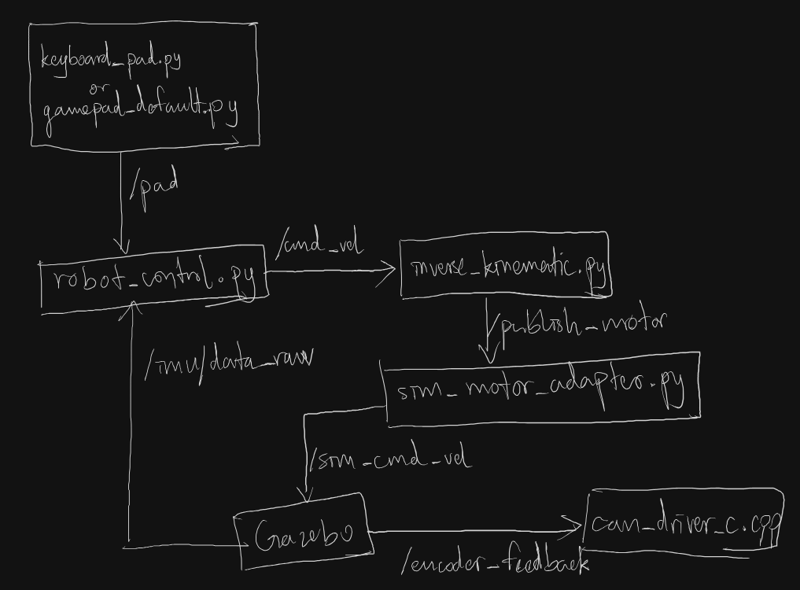

# Demo robot simulation

The simulation keeps the complete control chain:



## Dependencies

```bash
sudo apt install ros-lyrical-ros-gz ros-lyrical-joy
```

## Build

From the workspace root:

```bash
colcon build --packages-select custom_messages dc_controller_legacy demo_robot
source install/setup.zsh
```

## Keyboard control

```bash
ros2 launch demo_robot simulation.launch.py control_source:=keyboard
```

Use `w`/`s` for forward and backward, `a`/`d` for sideways motion,
`q`/`e` for turning, `k` to center the controls, and `x` for the existing
emergency-stop behavior.

## USB gamepad control

```bash
ros2 launch demo_robot simulation.launch.py control_source:=gamepad
```

The default mapping uses the left stick for translation, the right stick for
turning, and the X button for the existing emergency-stop behavior.

## Phone gamepad control

```bash
ros2 launch demo_robot simulation.launch.py control_source:=phone
```

Use `control_source:=external` when another node already publishes `/pad`.
